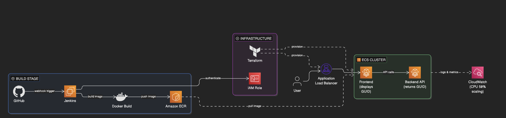
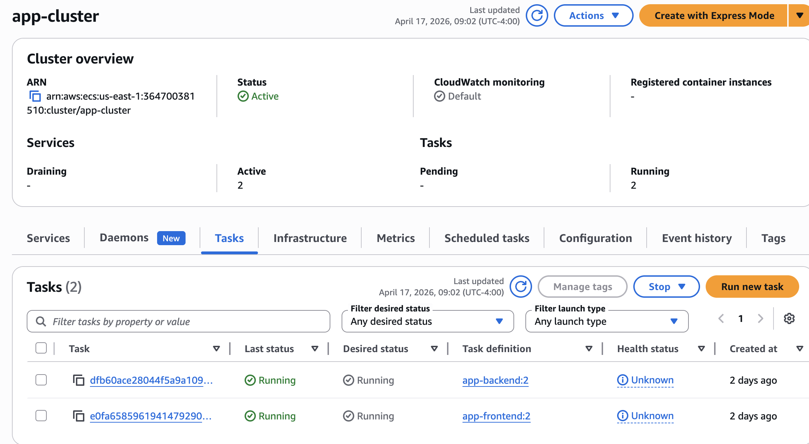
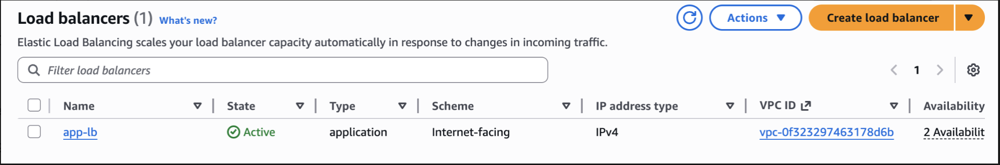
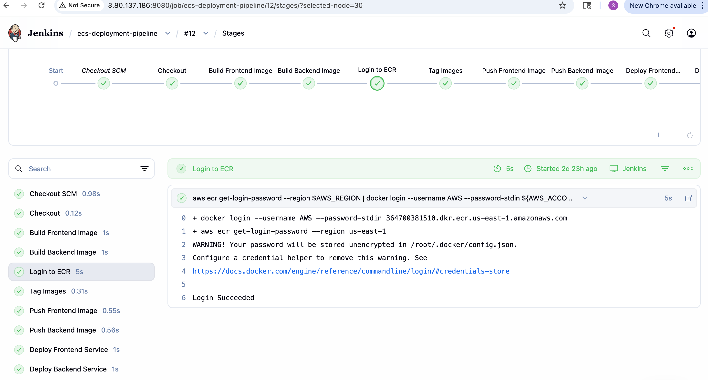
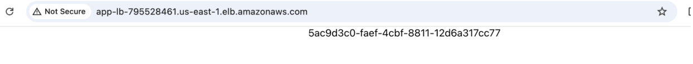

# ECS Fargate Microservices App – Automated Cloud Infrastructure
## Production-style microservices application deployed on AWS using ECS Fargate, Terraform, and CI/CD automation.

# 🚀 Features 
-  Containerized microservices deployed on AWS ECS Fargate
-  Application Load Balancer (ALB) for traffic distribution
-  CI/CD pipeline (Jenkins) for automated builds and deployments
-  Dockerized services for portability and consistency
-  Infrastructure provisioned using Terraform
-  Scalable architecture with ECS service auto-scaling
-  Secure networking using VPC, subnets, and security groups
--- 

# Architecture: 

User → ALB → ECS Fargate → Containers (Frontend + Backend)
CI/CD:
GitHub → Jenkins → Docker → ECS Deploy
Infrastructure:
Terraform → Provisions VPC, ECS, ALB, IAM
  

---

## ⚙️ Tech Stack

- AWS ECS Fargate
- Application Load Balancer (ALB)
- Docker
- Terraform
- Jenkins
---

## ⚠️ System Behavior & Scaling

- ECS maintains a desired number of running tasks for availability  
- ALB distributes traffic across healthy containers  
- Auto Scaling increases tasks based on CPU usage  
- Failed containers are automatically replaced  
- Rolling deployments enable zero-downtime updates  
---

## 💰 Cost & Tradeoffs

- Fargate removes server management but costs more than EC2  
- Chosen to reduce operational overhead and speed up deployment  
- Terraform adds setup complexity but enables repeatable infrastructure  
- CI/CD improves deployment speed but adds pipeline maintenance  
- ALB adds cost but provides high availability and fault tolerance  
---

## 🔐 Security

- IAM roles used instead of hardcoded credentials  
- Security groups restrict access to required ports only  
- Services deployed inside a VPC for isolation  
- Application exposed only through the ALB  
- No sensitive data stored in code

---

## 📸 Deployment Proof

### ECS Running Tasks

### Load Balancer

### CI/CD Pipeline

### Application Running

